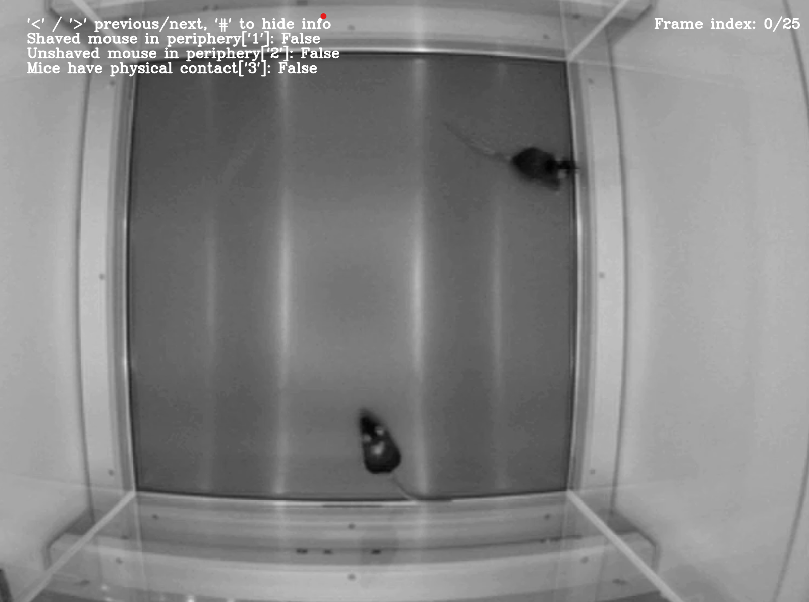
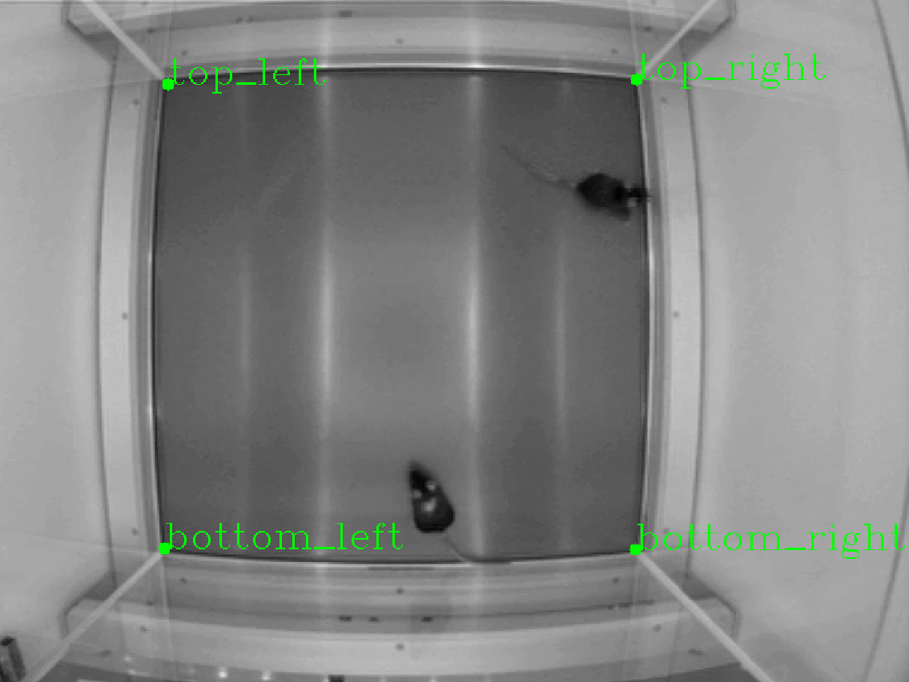

# User input tools

These are a few tools I wrote to facilitate reviewing output from other pipelines, or to make it easy to mark reference points in images.

## Image tagging
One main function allows tagging image paths with your keyboard and OpenCV, based on arbitrary keys.

```python
source_image_dir = pathlib.Path(r".\data\example_frame_directory")
example_image_paths = list(source_image_dir.glob("*.png"))

tag_key_dict = {
    "Shaved mouse in periphery": "1",
    "Unshaved mouse in periphery": "2",
    "Mice have physical contact": "3"
}

image_tagger = ImageTagger(example_image_paths, tag_key_dict=tag_key_dict, display_width=1400, multi_choice=True, title="Tagging images with mice")
tag_df = image_tagger.run()
```

This will open an interface such as shown below that contains information on what keys will tag the image, and the current frame index.



Once closed, it will return a boolean Pandas DataFrame with the information on which images had what tags added.

## Setting markers in images
The second main function allows for the annotation of arbitrary keypoints in an image.

```python
marker_names = ["top_left", "bottom_left", "bottom_right", "top_right"]
example_frame = cv2.imread(example_image_paths[0])
marker_positions = select_markers_gui(example_frame, marker_n_or_names=marker_names, auto_close=False)
```

This opens an OpenCV interface that allows the annotation of the provided markers:



Afterwards, this function will return a dictionary mapping the names shown in the image to their respective coordinates.
